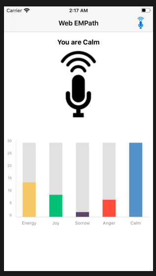

# EmotionAnalytics
An iOS app to detect emotion from vocal data using the emotion recognition program from [Empath](https://webempath.net).

## Required Library
PNChart (https://github.com/kevinzhow/PNChart)

## Empath API Integration
1. Sign up for an api key from [Empath](https://webempath.net)
1. Replace API_KEY value in EmotionAnalytic/EmWebInterface.m with the new api key
